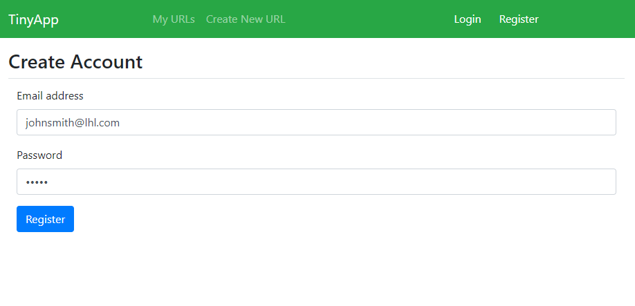
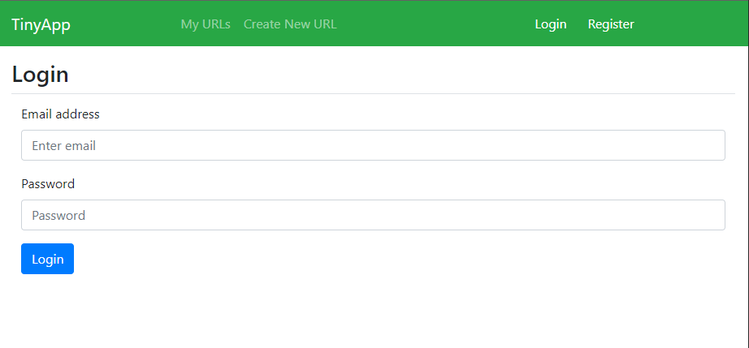
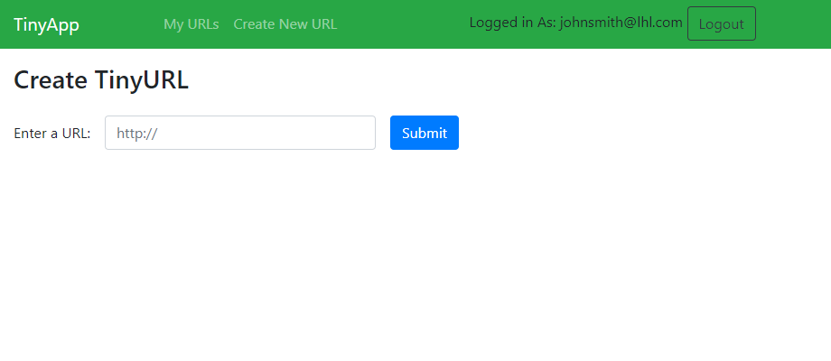
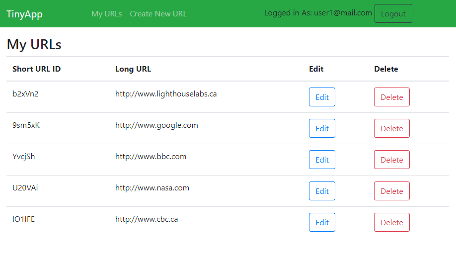
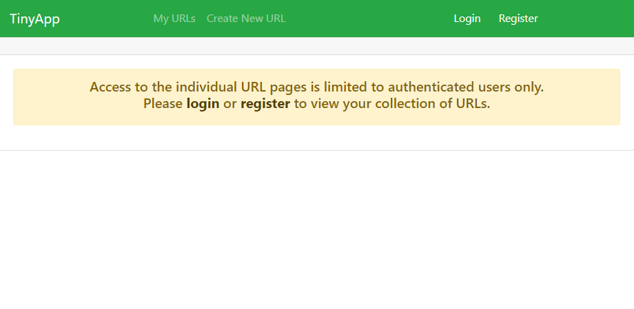
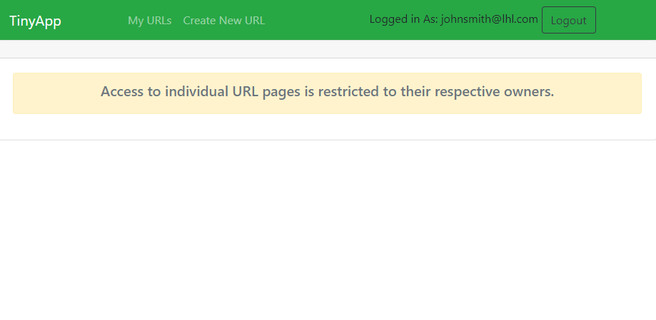

# :scissors: Welcome to TinyApp: Where URLs shrink faster than your socks in the dryer!! :raised_hands:

Imagine having the power to turn "https://www.thisismyreallylongandconfusingwebsite.com/please-dont-make-me-type-this-again" into something as snappy as "https://tinyapp.com/b2xVn4"! 

Whether you're sharing your favorite cat videos, sending important research papers, or secretly plotting to take over the world, TinyApp will make your URLs smaller, snappier, and totally manageable.

## TinyApp Project
This project is made by :raising_hand_woman: [Madiha Waqar](https://www.linkedin.com/in/madiha-waqar-a8253827) as part of Lighthouse Labs Web Development Flex Program curriculum. TinyApp is a full stack web application that allows user to shorten long URLS. This application is built by using both front-end `Javascript, HTML & CSS` and back-end `Node.js and Express.js` technologies.

## 

## :traffic_light: Dependencies

- bcryptjs
- cookie-session
- EJS
- Express
- Node.js
 
 ### Dev Dependencies
 - mocha and chai
 - nodemon

## :triangular_flag_on_post: Getting Started

- Clone this repository on your local machine.
- Install all dependencies (using the `npm install` command).
- Run the development web server using the `node express_server.js` command.
- Go to `localhost:8080` on your browser to spread the joy!

## :sparkles: Final Product

## :dart: Features

- **Register**
  - User have to register first to access the features of tiny app. Email field auto checks if your email is a properly-formatted email address.
  - Password field text is obscured so that it cannot be read.

- **Login**
  - Users must be logged in with valid credentials to view, create, edit or delete the urls that he has made.
  - > Only a logged in authenticated owner of the url have access rights to perform CRUD operations on url. 
  - > Access to individual URL pages is restricted to their respective owners.

- **Create New Links**
  - Click on Create New URL link to create a new tinyurl. The link will take you to TinyUrl page where you can enter your URL to shorten it. Click Submit.

- **Edit/ Update or Delete Links**
  - Logged in owner of the url can delete or edit his urls. 
    - After delete button is pressed the deleted url's record wont show on user's myurl page.
    - After edit/update the short url will remain the same but corresponding long url will get updated and user will get redirected to myurl page.

- ### Note:
  - You can access your url link by just using shortlink like this: `/u/:tinyurl` where *tinyurl* is the shortened url created against the long url.

## :bulb: Enjoy
Thank you for joining the TinyApp party! Remember, with my URL shortener, you can now fit more internet into your pocket. Enjoy and may your links be shorter than a cat's attention span chasing a laser pointer! Happy URL-ing! :wave: